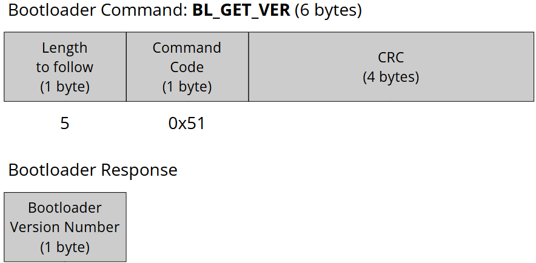
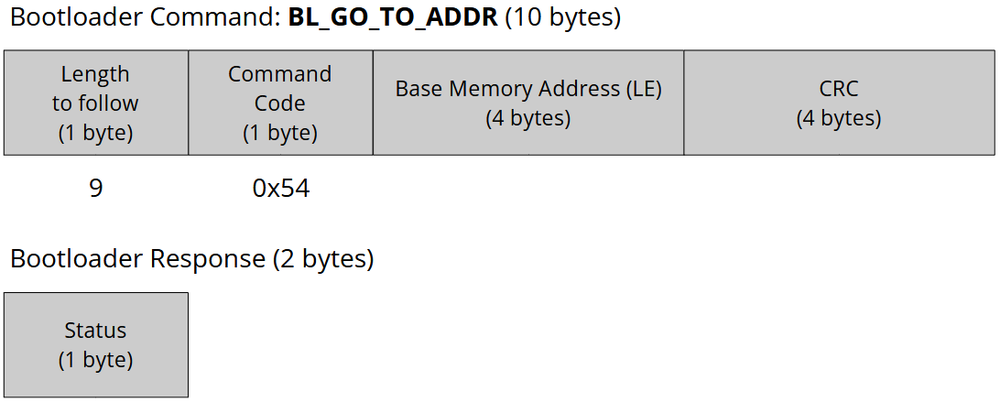

# STM32 MCU Custom Bootloader

This repository contains the source code for the **STM32 MCU Custom Bootloader** development project. Visit the "Bootloader" section on my website for more details: [https://kyungjae.com/notes/bootloader/](https://kyungjae.com/notes/bootloader/).

## Introduction

* Developing a custom bootloader for the STM32F407xx MCU family that allows the host to communicate with the
  bootloader over the USART interface and perform MCU‐speci ic operations through an interactive application
* Used ARM Keil MDK for software development, testing, and debugging

## Development Environment

* Operating system: Windows 11
* Integrated Development Environment (IDE): ARM Keil MDK

## Bootloader-Host Communication over USART Peripheral Interface

### Overview

### Host Application

* The host application runs on a host machine and provides the user with an interactive menu of the available bootloader commands.

## Bootloader Design

### Bootloader Code Placement in Flash (Main) Memory

### Supported Bootloader Commands

| Host Sends        | Command Code | Bootloader Responds                                        | Notes                                                        |
| ----------------- | ------------ | ---------------------------------------------------------- | ------------------------------------------------------------ |
| BL_GET_VER        | 0x51         | Bootloader version number (1 byte)                         | Used to read the bootloader version from the MCU             |
| BL_GET_HELP       | 0x52         | All supported command codes (1 byte per supported command) | Used to retrieve all the commands that are supported by the bootloader |
| BL_GET_CID        | 0x53         | Chip identification number (2 bytes)                       | Used to get the MCU chip identification number               |
| BL_GO_TO_ADDR     | 0x54         | Success or error code (1 byte)                             | Used to jump bootloader to specified address                 |
| BL_ERASE_FLASH    | 0x55         | Success or error code (1 byte)                             | Used to mass-erase or sector-erase the user Flash            |
| BL_READ_MEM       | 0x56         | Memory contents of length asked by the host                | Used to read data from different memories of the MCU         |
| BL_WRITE_MEM      | 0x57         | Success or error code (1 byte)                             | Used to write data into different memories of the MCU        |
| BL_GET_RDP_LEVEL  | 0x58         | Flash Read Protection (RDP) level (1 byte)                 | Used to read the Flash Read Protection (RDP) level           |
| BL_SET_RDP_LEVEL  | 0x59         | Success or error code (1 byte)                             | Used to set the Flash Read Protection (RDP) level            |
| BL_ENABLE_WRP     | 0x5A         | Success or error code (1 byte)                             | Used to enable the Write Protection (WRP) for the selected sectors of the user Flash memory |
| BL_DISABLE_WRP    | 0x5B         | Success or error code (1 byte)                             | Used to disable the Write Protection (WRP) for all the sectors of the user Flash (i.e., Restores the default protection state) |
| BL_GET_WRP_STATUS | 0x5C         | All sectors' Write Protection (WRP) status                 | Used to read the Write Protection (WRP) status of all the sectors of the user Flash memory |
| BL_READ_OTP       | 0x5D         | OTP contents                                               | Used to read the OTP contents                                |

>BL_GO_TO_ADDR: When entering the target address to the host application, make sure to account for the T-bit setting. For example, If the address of the user application's reset handler is 0x08008229, then enter 0x08008228. Please see the bootloader source code for more details.

### Host-Bootloader Communication Sequence

* Upon reset, the MCU will go through the initialization process and then will hang at some point (e.g., USART receive function) ready to receive commands from the host.
* Upon receiving a command from the host, the bootloader performs CRC check. It ACKs if the CRC check has succeeded,  NACKs otherwise.
* After ACKing, the bootloader sends its response to the host.

### Custom Bootloader Flow Chart

### Bootloader Command Handling Flow Chart

## Bootloader Commands in Detail

* For every bootloader command
  * First byte - **Length to follow**
  * The second byte - **Command code** sent by the host to the bootloader
  * The last four bytes - **CRC** to check the integrity of the bytes received from the host.

### BL_GET_VER

* Used to read the bootloader version from the MCU

* Total length (in bytes) of the packet: 6
* Length to follow: 5
* Command code: 0x51

### BL_GET_HELP

* Used to retrieve all the commands that are supported by the bootloader

* Total length (in bytes) of the packet: 6
* Length to follow: 5
* Command code: 0x52

### GL_GET_CID

* Used to read the MCU chip identification number

* Total length (in bytes) of the packet: 6
* Length to follow: 5
* Command code: 0x53

### BL_GO_TO_ADDR

* Used to jump the bootloader to a specified address
* Total length (in bytes) of the packet: 10
* Length to follow: 9
* Command code: 0x54
* Base memory address: 4-byte base memory address to jump to (LE: Little Endian)

### BL_ERASE_FLASH

* Used to mass-erase (all sectors) or sector-erase the user Flash
* Total length (in bytes) of the packet: 8
* Length to follow: 7
* Command code: 0x55

### BL_READ_MEM

* Used to read data from different memories (e.g., Flash, SRAM, etc.) of the MCU
* Total length (in bytes) of the packet: 11
* Length to follow: 10
* Command code: 0x56
* Base memory address: 4-byte base memory address from which the reading will take place (LE: Little Endian)
* Length: The number of bytes to read (Max: 255 bytes)

### BL_WRITE_MEM

* Used to write data into different memories (e.g., Flash, SRAM, etc.) of the MCU 
  * e.g., Programming binary into the Flash memory
* Total length (in bytes) of the packet: 11+n
* Length to follow: 10+n
* Command code: 0x57
* Base memory address: 4-byte base memory address from which the writing will take place (LE: Little Endian)
* Payload length: The number of bytes to write (Max: 255 bytes)
* Payload: Data to write

### BL_GET_RDP_LEVEL

* Used to read the Flash Read Protection (RDP) level
* Total length (in bytes) of the packet: 6
* Length to follow: 5
* Command code: 0x58

### BL_SET_RDP_LEVEL

* Used to set the Flash Read Protection (RDP) level

* Total length (in bytes) of the packet: 7

* Length to follow: 6

* Command code: 0x59

* Read protect level:

  * 0: Level 0, read protection not active

  * 1: Level 1, read protection of memories active

  * 2: Level 2, chip read protection active

### BL_ENABLE_WRP

* Used to enable the Write Protection (WRP) for the selected sectors of the user Flash memory
* Total length (in bytes) of the packet: 8
* Length to follow: 7
* Command code: 0x5A
* Sector not write protect (Each bit represents the sector number; e.g., 0^th^ bit is sector 0)
  * 0: Write protection active on selected sector
  * 1: Write protection inactive on selected sector

### BL_DISABLE_WRP

* Used to disable the Write Protection (WRP) for all the sectors of the user Flash (i.e., Restores the default protection state)
* Total length (in bytes) of the packet: 6
* Length to follow: 5
* Command code: 0x5B

### BL_GET_WRP_STATUS

* Used to read the Write Protection (WRP) status of all the sectors of the user Flash memory
* Total length (in bytes) of the packet: 6
* Length to follow: 5
* Command code: 0x5C

